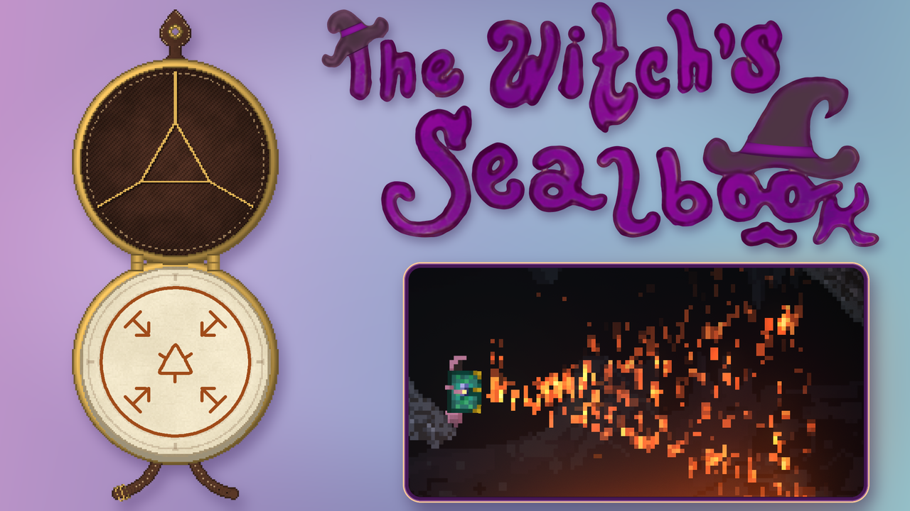
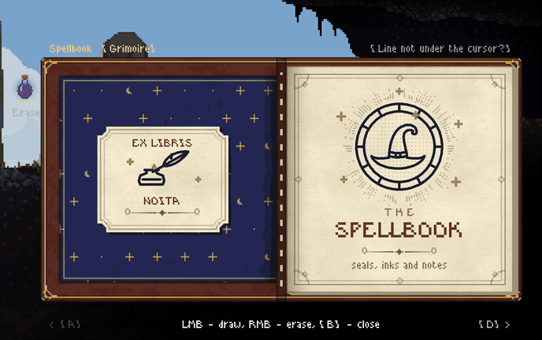
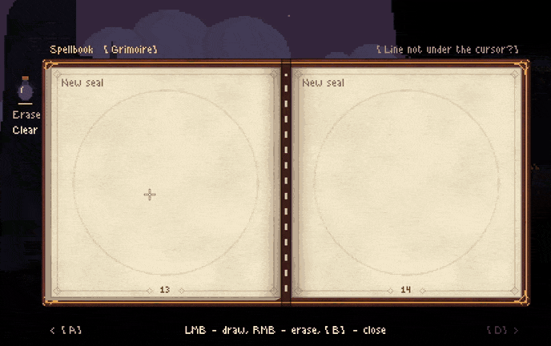

# The Witch's Sealbook

A [Noita](https://noitagame.com/) mod: draw magic seals by hand and cast them, as in *Witch Hat Atelier*.



Open the spellbook (default key **B**), draw a seal with the mouse — a **ring**, an **element sigil** in the middle and
**signs** around it — and cast it by clicking with the book in hand. The drawing is read like a small program: the
sigil picks the element, the signs shape it into a shot, a wave, an orb, rain, a field or a ring of lights, and make it
push, pull, bind, reflect or follow enemies. Sigils, forms and signs combine into more than 5,000 different seals.





- 127 seals from the manga and the wiki in the Grimoire, learned from seal sheets found in the world or by drawing them
- seven inks that change how a seal behaves
- three books: the Spellbook, the small Palm Quire and the Great Tome for the biggest seals

**Install:** subscribe on the [Steam Workshop](https://steamcommunity.com/sharedfiles/filedetails/?id=3813350195), or
put this folder into `Noita/mods/witch_notebook` and enable it in the Mods menu.

## Layout

| Path | What |
| --- | --- |
| `init.lua`, `settings.lua` | entry point and mod settings |
| `files/notebook.lua`, `book_*.lua`, `page_turn.lua` | the book's GUI: drawing, pages, flipping |
| `files/seal.lua`, `recognizer.lua`, `templates.lua` | reading a drawing into a seal tree ($P+ point-cloud recognizer) |
| `files/seal_spell.lua`, `dictionary.lua`, `cast.lua`, `manifest.lua` | meaning of a seal and casting it |
| `files/effects/`, `files/behaviors/` | the spells' effects in the world, including a small fluid solver for fire |
| `files/grimoire.lua` | the wiki's seals (generated by `tools/make_grimoire.py`) |
| `docs/` | design notes; start with `docs/architecture.md` |
| `tools/` | generators for templates, the grimoire, sprites |
| `tests/` | offline tests that run the mod's Lua against stubs of the game API |

## Tests

```
pip install lupa pillow
cd tests
python -m unittest discover -p "test_*.py"
python run_tests.py          # recognition and the notebook scenario, ~10 min
```

Some tests and tools read Noita's unpacked `data/` folder or a local copy of the wiki in `../reference/`; they need
them to run.

## License

The mod's code and art are under the [MIT License](LICENSE). Seal shapes from wha-spell-simulator (MIT) and from the
Independent Witch Hat Atelier Wiki (CC BY-SA 3.0) keep their own licenses — see
[THIRD_PARTY_NOTICES.md](THIRD_PARTY_NOTICES.md).

This is an unofficial fan project. *Witch Hat Atelier* is © Kamome Shirahama / Kodansha; Noita is © Nolla Games.
